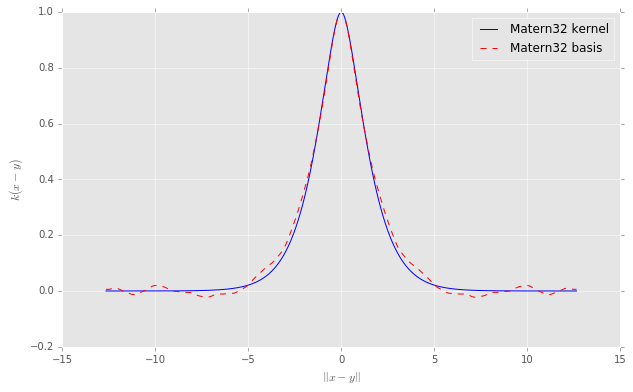
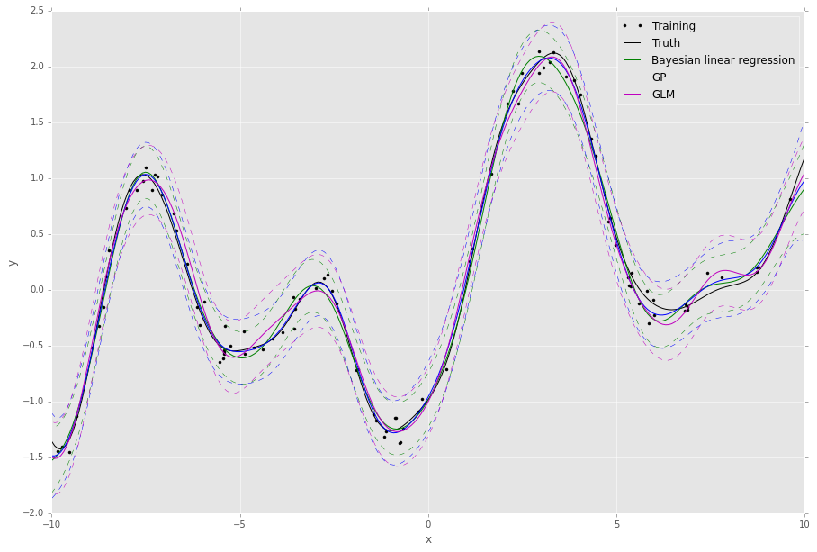
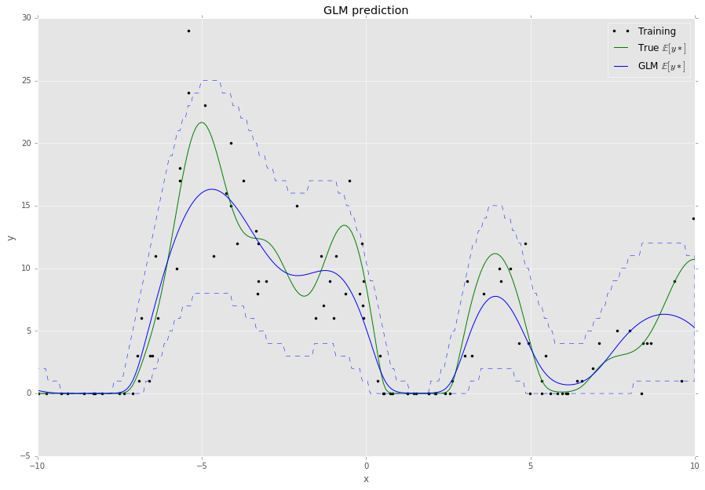

=======
revrand 
=======

.. image:: https://travis-ci.org/NICTA/revrand.svg?branch=master
   :target: https://travis-ci.org/NICTA/revrand

.. image:: https://codecov.io/github/NICTA/revrand/coverage.svg?branch=master
    :target: https://codecov.io/github/NICTA/revrand?branch=master

------------------------------------------------------------------------------
A library of scalable Bayesian generalised linear models with *fancy* features
------------------------------------------------------------------------------

This library implements various Bayesian linear models (Bayesian linear
regression) and generalised linear models. A few features of this library are:

- A fancy basis functions/feature composition framework for combining basis
  functions like radial basis function, sigmoidal basis functions, polynomial
  basis functions etc.
- Basis functions that can be used to approximate Gaussian processes with shift
  invariant covariance functions (e.g. square exponential) when used with
  linear models [1]_, [2]_, [3]_.
- Non-Gaussian likelihoods with Bayesian generalised linear models (GLMs). We
  infer all of the parameters in the GLMs using auto-encoding variational
  Bayes [4]_, and we approximate the posterior over the weights with a mixture
  of Gaussians, like [5]_.
- Large scale learning using stochastic gradients (Adam, AdaDelta and more).
- Scikit Learn compatibility, i.e. usable with 
  `pipelines <http://scikit-learn.org/stable/modules/pipeline.html>`_.

Here is an example of approximating a Matern 3/2 kernel with some of our basis
functions,

here is an example of the algorithms in *revrand* approximating a Gaussian
Process,

and here is an example of running using our Bayesian GLM with a Poisson
likelihood and integer observations,

Have a look at some of the demo `notebooks <demos/>`_ for how we generated
these plots, and more!

Quickstart
----------

To install, simply run ``setup.py``:

.. code:: console

   $ python setup.py install

or install with ``pip``:

.. code:: console

   $ pip install git+https://github.com/nicta/revrand.git

Now have a look at our `quickstart guide <docs/quickstart.rst>`_ to get up and
running quickly!

Refer to `docs/installation.rst <docs/installation.rst>`_ for advanced 
installation instructions.

Useful Links
------------

Home Page
    http://github.com/nicta/revrand

Documentation
    http://nicta.github.io/revrand

Report on the algorithms in *revrand*
    https://github.com/NICTA/revrand/blob/master/docs/report/report.pdf

Issue tracking
    https://github.com/nicta/revrand/issues

Bugs & Feedback
---------------

For bugs, questions and discussions, please use 
`Github Issues <https://github.com/NICTA/revrand/issues>`_.

Authors
-------

- `Daniel Steinberg <https://github.com/dsteinberg>`_
- `Louis Tiao <https://github.com/ltiao>`_
- `Alistair Reid <https://github.com/AlistaiReid>`_
- `Lachlan McCalman <https://github.com/lmccalman>`_
- `Simon O'Callaghan <https://github.com/socallaghan>`_

References
----------

.. [1] Yang, Z., Smola, A. J., Song, L., & Wilson, A. G. "A la Carte --
   Learning Fast Kernels". Proceedings of the Eighteenth International
   Conference on Artificial Intelligence and Statistics, pp. 1098-1106,
   2015.
.. [2] Le, Q., Sarlos, T., & Smola, A. "Fastfood-approximating kernel
   expansions in loglinear time." Proceedings of the international conference
   on machine learning. 2013.
.. [3] Rahimi, A., & Recht, B. "Random features for large-scale kernel
   machines". Advances in neural information processing systems. 2007. 
.. [4] Kingma, D. P., & Welling, M. "Auto-encoding variational Bayes".
   Proceedings of the 2nd International Conference on Learning Representations
   (ICLR). 2014.
.. [5] Gershman, S., Hoffman, M., & Blei, D. "Nonparametric variational
   inference". Proceedings of the international conference on machine learning.
   2012.

Copyright & License
-------------------

Copyright 2015 National ICT Australia.

Licensed under the Apache License, Version 2.0 (the "License");
you may not use this file except in compliance with the License.
You may obtain a copy of the License at

http://www.apache.org/licenses/LICENSE-2.0

Unless required by applicable law or agreed to in writing, software
distributed under the License is distributed on an "AS IS" BASIS,
WITHOUT WARRANTIES OR CONDITIONS OF ANY KIND, either express or implied.
See the License for the specific language governing permissions and
limitations under the License.
