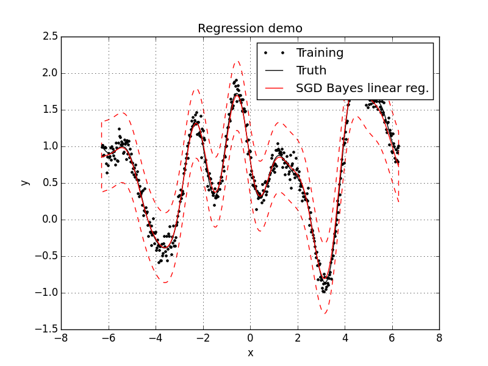

=======
revrand 
=======

.. image:: https://travis-ci.org/NICTA/revrand.svg?branch=master
   :target: https://travis-ci.org/NICTA/revrand

------------------------------------------------------------------------------
A library of scalable Bayesian generalised linear models with *fancy* features
------------------------------------------------------------------------------

This library implements various Bayesian linear models (Bayesian linear
regression) and generalised linear models (logistic regression). A few features
of this library are:

- A fancy basis functions/feature composition framework for combining basis
  functions like radial basis function, sigmoidal basis functions, polynomial
  basis functions etc.
- Basis functions that can be used to approximate Gaussian processes with shift
  invariant covariance functions (e.g. square exponential) when used with
  linear models [1]_, [2]_, [3]_.
- Large scale learning using stochastic gradient descent (ADADELTA).

Quickstart
----------

To install, simply run ``setup.py``:

.. code:: console

   $ python setup.py install

or install with ``pip``:

.. code:: console

   $ pip install git+https://github.com/nicta/revrand.git@release

Refer to `docs/installation.rst <docs/installation.rst>`_ for advanced 
installation instructions.

Have a look at some of the `demos <demos/>`_, e.g.: 

.. code:: console

   $ python demos/demo_alacarte.py

Here is a very quick example of how to use Bayesian linear regression with SGD
optimisation of the likelihood noise, regulariser and basis function
parameters. Assuming we already have training noisy targets ``y``, inputs 
``X``, and some query inputs ``Xs`` (as well as the true noiseless function
``f``):

.. code:: python

    import matplotlib.pyplot as pl
    import numpy as np
    from revrand.basis_functions import LinearBasis, RandomRBF
    from revrand.regression import bayeslinear_sgd, bayeslinear_predict
    
    # Concatenate a linear basis and a Random radial basis (GP approx)
    basis = LinearBasis(onescol=True) + RandomRBF(nbases=300, Xdim=X.shape[1])
    init_lenscale = 1.0

    # Learn regression parameters and predict
    params = bayeslinear_sgd(X, y, basis, [init_lenscale])
    Eys, Vfs, Vys = bayeslinear_predict(Xs, basis, *params) 

    # Training/Truth
    pl.plot(X, y, 'k.', label='Training')
    pl.plot(Xs, f, 'k-', label='Truth')

    # SGD Regressor
    Sys = np.sqrt(Vys)
    pl.plot(Xs, Eys, 'r-', label='SGD Bayes linear reg.')
    pl.fill_between(Xs, Eys - 2 * Sys, Eys + 2 * Sys, facecolor='none',
                    edgecolor='r', linestyle='--', label=None)

    pl.legend()

    pl.grid(True)
    pl.title('Regression demo')
    pl.ylabel('y')
    pl.xlabel('x')
    pl.show()

This script will output something like the following,

Useful Links
------------

Home Page
    http://github.com/nicta/revrand

Documentation
    http://nicta.github.io/revrand

Issue tracking
    https://github.com/nicta/revrand/issues

Bugs & Feedback
---------------

For bugs, questions and discussions, please use `Github Issues <https://github.com/NICTA/revrand/issues>`_.

References
----------

.. [1] Yang, Z., Smola, A. J., Song, L., & Wilson, A. G. "A la Carte --
   Learning Fast Kernels". Proceedings of the Eighteenth International
   Conference on Artificial Intelligence and Statistics, pp. 1098-1106,
   2015.
.. [2] Le, Q., Sarlos, T., & Smola, A. "Fastfood-approximating kernel
   expansions in loglinear time." Proceedings of the international conference
   on machine learning. 2013.
.. [3] Rahimi, A., & Recht, B. "Random features for large-scale kernel
   machines." Advances in neural information processing systems. 2007. 

Copyright & License
-------------------

Copyright 2015 National ICT Australia.

Licensed under the Apache License, Version 2.0 (the "License");
you may not use this file except in compliance with the License.
You may obtain a copy of the License at

http://www.apache.org/licenses/LICENSE-2.0

Unless required by applicable law or agreed to in writing, software
distributed under the License is distributed on an "AS IS" BASIS,
WITHOUT WARRANTIES OR CONDITIONS OF ANY KIND, either express or implied.
See the License for the specific language governing permissions and
limitations under the License.
