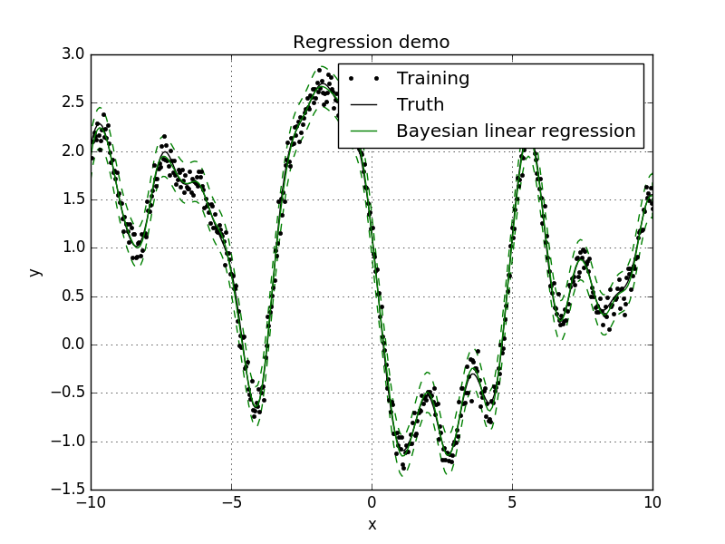
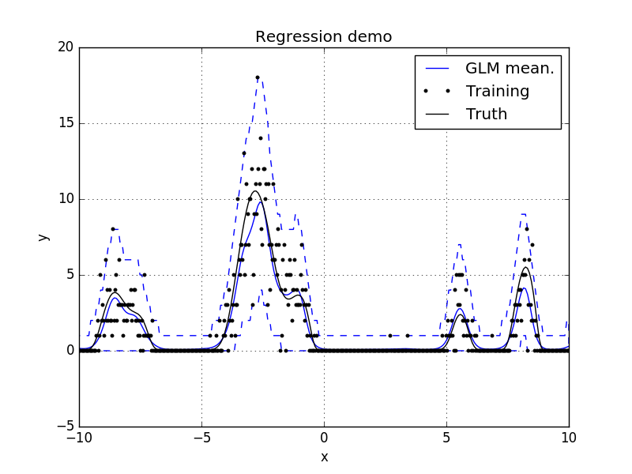
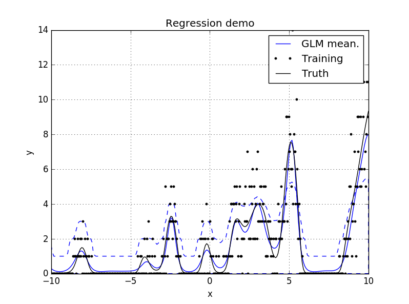

=======
revrand 
=======

.. image:: https://travis-ci.org/NICTA/revrand.svg?branch=master
   :target: https://travis-ci.org/NICTA/revrand

.. image:: https://codecov.io/github/NICTA/revrand/coverage.svg?branch=master
    :target: https://codecov.io/github/NICTA/revrand?branch=master

------------------------------------------------------------------------------
A library of scalable Bayesian generalised linear models with *fancy* features
------------------------------------------------------------------------------

This library implements various Bayesian linear models (Bayesian linear
regression) and generalised linear models. A few features of this library are:

- A fancy basis functions/feature composition framework for combining basis
  functions like radial basis function, sigmoidal basis functions, polynomial
  basis functions etc.
- Basis functions that can be used to approximate Gaussian processes with shift
  invariant covariance functions (e.g. square exponential) when used with
  linear models [1]_, [2]_, [3]_.
- Non-Gaussian likelihoods with Bayesian generalised linear models using a
  modified version of the nonparametric variational inference algorithm
  presented in [4]_.
- Large scale learning using stochastic gradient descent (ADADELTA and more).

Quickstart
----------

To install, simply run ``setup.py``:

.. code:: console

   $ python setup.py install

or install with ``pip``:

.. code:: console

   $ pip install git+https://github.com/nicta/revrand.git

Refer to `docs/installation.rst <docs/installation.rst>`_ for advanced 
installation instructions.

Have a look at some of the `demos <demos/>`_, e.g.: 

.. code:: console

   $ python demos/demo_regression.py

Or,

.. code:: console

   $ python demos/demo_glm.py

Bayesian Linear Regression Example
..................................

Here is a very quick example of how to use Bayesian linear regression with
optimisation of the likelihood noise, regulariser and basis function
parameters. Assuming we already have training noisy targets ``y``, inputs 
``X``, and some query inputs ``Xs`` (as well as the true noiseless function
``f``):

.. code:: python

    import matplotlib.pyplot as pl
    import numpy as np
    from revrand.basis_functions import LinearBasis, RandomRBF
    from revrand.slm import learn, predict
    from revrand.btypes import Parameter, Positive

    ...
    
    # Concatenate a linear basis and a Random radial basis (GP approx)
    init_lenscale = Parameter(1.0, Positive())  # init val and bounds 
    basis = LinearBasis(onescol=True) \
        + RandomRBF(nbases=300, Xdim=X.shape[1], init_lenscale)

    # Learn regression parameters and predict
    params = slm.learn(X, y, basis)
    Eys, Vfs, Vys = slm.predict(Xs, basis, *params) 

    # Training/Truth
    pl.plot(X, y, 'k.', label='Training')
    pl.plot(Xs, f, 'k-', label='Truth')

    # Plot Regressor
    Sys = np.sqrt(Vys)
    pl.plot(Xs, Eys, 'g-', label='Bayesian linear regression')
    pl.fill_between(Xs, Eys - 2 * Sys, Eys + 2 * Sys, facecolor='none',
                    edgecolor='g', linestyle='--', label=None)

    pl.legend()

    pl.grid(True)
    pl.title('Regression demo')
    pl.ylabel('y')
    pl.xlabel('x')
    pl.show()

This script will output something like the following,

Bayesian Generalised Linear Model Example
.........................................

This example is very similar to that above, but now let's assume our targets
``y`` are drawn from a Poisson likelihood, or observation, distribution which
is a function of the inputs, ``X``. The task here is to predict the mean of the
Poisson distribution for query inputs ``Xs``, as well as the uncertainty
associated with the prediction.

.. code:: python

    import matplotlib.pyplot as pl
    import numpy as np
    from revrand.basis_functions import RandomRBF
    from revrand.glm import learn, predict_moments, predict_interval

    ...
    
    # Random radial basis (GP approx)
    init_lenscale = Parameter(1.0, Positive())  # init val and bounds 
    basis = RandomRBF(nbases=100, Xdim=X.shape[1], init_lenscale)

    # Set up the likelihood of the GLM
    llhood = likelihoods.Poisson(tranfcn='exp')  # log link

    # Learn regression parameters and predict
    params = learn(X, y, llhood, basis)
    Eys, _, _, _ = predict_moments(Xs, llhood, basis, *params) 
    y95n, y95x = predict_interval(0.95, Xs, llhood, basis, *params)

    # Training/Truth
    pl.plot(X, y, 'k.', label='Training')
    pl.plot(Xs, f, 'k-', label='Truth')

    # Plot GLM SGD Regressor
    pl.plot(Xs, Eys, 'b-', label='GLM mean.')
    pl.fill_between(Xs, y95n, y95x, facecolor='none',
                    edgecolor='b', linestyle='--', label=None)

    pl.legend()

    pl.grid(True)
    pl.title('Regression demo')
    pl.ylabel('y')
    pl.xlabel('x')
    pl.show()

This script will output something like the following,

Large-scale Learning with Stochastic Gradients
..............................................

By default the GLM uses stochastic gradients to learn all of its
parameters/hyperparameters and does not require any matrix inversion, and so it
can be used to learn from large datasets with lots of features
(slm.learn uses L-BFGS and requires a matrix inversion). We can also use
the GLM to approximate and scale up regular Bayesian linear regression. For
instance, if we modify the Bayesian linear regression example from before,

.. code:: python

    ...

    from revrand import glm, likelihoods

    ...

    # Set up the likelihood of the GLM
    llhood = likelihoods.Gaussian(var_init=Parameter(1., Positive()))

    # Learn regression parameters and predict
    params = glm.learn(X, y, llhood, basis)
    Ey_g, Vf_g, Eyn, Eyx = glm.predict_moments(Xtest, llhood, base, *params)

    ...

    # Plot GLM SGD Regressor
    Sy_g = np.sqrt(Vy_g)
    pl.plot(Xpl_s, Ey_g, 'm-', label='GLM')
    pl.fill_between(Xs, Ey_g - 2 * Sy_g, Ey_g + 2 * Sy_g, facecolor='none',
                    edgecolor='m', linestyle='--', label=None)

    ...

This script will output something like the following,

We can see the approximation from the GLM is pretty good - this is because it
uses a mixture of diagonal Gaussians posterior (thereby avoiding a full matrix
inversion) to approximate the full Gaussian posterior covariance over the
weights. This also has the advantage of allowing the model to learn multi-modal
posterior distributions when non-Gaussian likelihoods are required.

Feature Composition Framework
.............................

We have implemented an easy to use and extensible feature-building framework
within revrand. You have already seen the basics demonstrated in the above
examples, i.e. concatenation of basis functions,

.. code:: python

    >>> X = np.random.randn(100, 5)
    >>> N, d = X.shape
    >>> base = LinearBasis(onescol=True) + RandomRBF(Xdim=d, nbases=100)
    >>> lenscale = 1.
    >>> Phi = base(X, lenscale)
    >>> Phi.shape
    (100, 206)

There are a few things at work in this example:

- Both ``LinearBasis`` and ``RandomRBF`` are applied to all of ``X``, and the
  result is concatenated.
- ``LinearBasis`` has pre-pended a column of ones onto ``X`` so a subsequent
  algorithm can learn a "bias" term.
- ``RandomRBF`` is actually approximating a radial basis *kernel* function,
  [3]_, so we can approximate how a kernel machine functions with a basis
  function!  This also outputs ``2 * nbases`` number of basis functions.
- Hence the resulting basis function has a shape of 
  ``(N, d + 1 + 2 * nbases)``.

We can also use *partial application* of basis functions, e.g.

.. code:: python

    >>> base = LinearBasis(onescol=True, apply_ind=slice(0, 2)) \
        + RandomRBF(Xdim=d, nbases=100, apply_ind=slice(2, 5))
    >>> Phi = base(X, lenscale)
    >>> Phi.shape
    (100, 203)

Now the basis functions are applied to seperate dimensions of the input, ``X``.
That is, ``LinearBasis`` takes dimensions 0 and 1, and ``RandomRBF`` takes the
rest, and again the results are concatenated.

Finally, if we use these basis functions with any of the algorithms in this
revrand, *the parameters of the basis functions are learned* as well! So
really in the above example ``lenscale = 1.`` is just an initial value for
the kernel function length-scale!

Scikit Learn Interface and Pipeline Compatibility
.................................................

We also provide the ability to use the standard and generalised linear models,
and our basis function objects with Scikit Learn pipelines. Have a look at the
``revrand.skl`` module for the compatible interfaces. You can also use these
interfaces if you prefer the Scikit Learn class paradigm (fit, predict,
transform etc methods), instead of our function-based paradigm (learn, predict
functions).

Useful Links
------------

Home Page
    http://github.com/nicta/revrand

Documentation
    http://nicta.github.io/revrand

Issue tracking
    https://github.com/nicta/revrand/issues

Bugs & Feedback
---------------

For bugs, questions and discussions, please use 
`Github Issues <https://github.com/NICTA/revrand/issues>`_.

References
----------

.. [1] Yang, Z., Smola, A. J., Song, L., & Wilson, A. G. "A la Carte --
   Learning Fast Kernels". Proceedings of the Eighteenth International
   Conference on Artificial Intelligence and Statistics, pp. 1098-1106,
   2015.
.. [2] Le, Q., Sarlos, T., & Smola, A. "Fastfood-approximating kernel
   expansions in loglinear time." Proceedings of the international conference
   on machine learning. 2013.
.. [3] Rahimi, A., & Recht, B. "Random features for large-scale kernel
   machines." Advances in neural information processing systems. 2007. 
.. [4] Gershman, S., Hoffman, M., & Blei, D. "Nonparametric variational
   inference". arXiv preprint arXiv:1206.4665 (2012).

Copyright & License
-------------------

Copyright 2015 National ICT Australia.

Licensed under the Apache License, Version 2.0 (the "License");
you may not use this file except in compliance with the License.
You may obtain a copy of the License at

http://www.apache.org/licenses/LICENSE-2.0

Unless required by applicable law or agreed to in writing, software
distributed under the License is distributed on an "AS IS" BASIS,
WITHOUT WARRANTIES OR CONDITIONS OF ANY KIND, either express or implied.
See the License for the specific language governing permissions and
limitations under the License.
